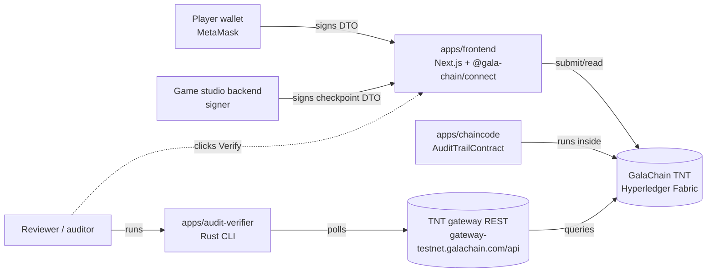
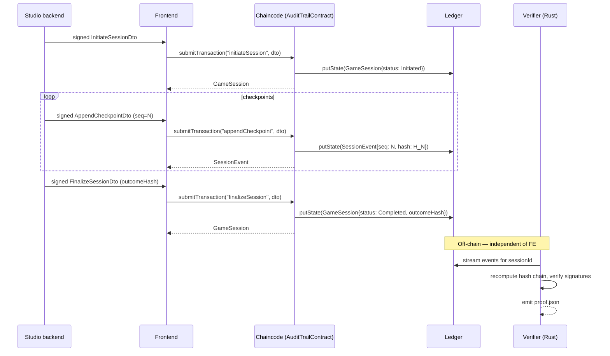
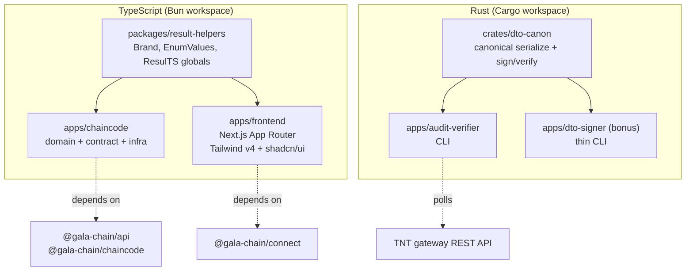

# SAD — System Architecture Document

**Project:** Gala Audit Trail Showcase
**Status:** Draft (locked-in decisions migrate to ADRs as they're finalized)

> Lightweight version. Real projects get a fuller SAD with deployment views, threat model, capacity planning. Here we cover what reviewers need to understand the system shape.

## 1. Context diagram

Three components own the user-facing surface; one component (`audit-verifier`) is independent and adversarial — it deliberately does not trust the chaincode.

## 2. Bounded contexts

| Context | Owner | Responsibility |
|---------|-------|----------------|
| **Audit Trail Domain** | `apps/chaincode/src/domain/` | Pure domain logic — entities (`GameSession`, `SessionEvent`), use cases (`initiateSession`, `appendCheckpoint`, `finalizeSession`, `verifyIntegrity`), invariants, `DomainError`. No SDK dependency. |
| **Audit Trail Contract** | `apps/chaincode/src/contracts/`, `apps/chaincode/src/infra/` | SDK boundary — `AuditTrailContract` (exposes domain via GalaChain SDK), repository wrappers around the ledger, error adapter (`DomainError` / `InfraError` → `ChainError`). |
| **Frontend Client** | `apps/frontend/` | Wallet connection, DTO signing, session UI, off-chain verification trigger. Wraps `@gala-chain/connect` + `BrowserConnectClient` in adapters returning `Result<T, ClientError>`. |
| **Off-Chain Verification** | `apps/audit-verifier/`, `crates/dto-canon/` | Independent verifier — recomputes hash chain from public stream, validates signatures, emits proof. Adversarial — assumes chaincode may be compromised. |

The first two share a process (the chaincode); the next two are separate processes. Communication between contexts goes through clearly typed boundaries: SDK contracts (`@gala-chain/api` DTOs), HTTP via `@gala-chain/connect`, and stream API for the verifier.

## 3. Sequence — happy path

## 4. Component view

Two workspaces, one repo. Bun and Cargo coexist at the root. CI runs both pipelines in parallel.

## 5. Aggregates and entities (summary)

Detail in [`sdds/sdd-audit-trail-aggregate.md`](./sdds/sdd-audit-trail-aggregate.md).

- **`GameSession`** — aggregate root. Owns lifecycle (`Initiated → InProgress → Completed | Disputed`), the player set, and the outcome hash.
- **`SessionEvent`** — entity inside the `GameSession` aggregate. Strictly sequenced (`sequence: u64`), each carrying its own signed payload and a `prevHash` link forming the hash chain.

## 6. Error model

`DomainError`, `InfraError`, `ClientError` (TS) and per-module `thiserror` enums (Rust) — all const-object-as-enum (TS) / `EnumValues<typeof X>` derived. Single throw site in the chaincode is the `AuditTrailContract` adapter, mapping domain/infra errors to `ChainError`. Detail in [`adrs/0005-result-type-domain-boundary.md`](./adrs/0005-result-type-domain-boundary.md) and [`playbook.md`](./playbook.md).

## 7. Technology choices (traceability to ADRs)

| Decision | ADR |
|----------|-----|
| Domain model: split `Session` / `Event` aggregates | [`0001`](./adrs/0001-domain-model.md) |
| Event sequencing strategy + integrity check | [`0002`](./adrs/0002-event-sequencing.md) |
| Signature scheme + signer authorization | [`0003`](./adrs/0003-signature-strategy.md) |
| Frontend architecture (SSR/CSR, wallet state) | [`0004`](./adrs/0004-frontend-architecture.md) |
| Result/Option discipline + SDK exception boundary | [`0005`](./adrs/0005-result-type-domain-boundary.md) |
| AI-assisted development methodology | [`0006`](./adrs/0006-ai-assisted-development.md) |
| Off-chain verification strategy (Rust) | [`0007`](./adrs/0007-off-chain-verification-strategy.md) |

## 8. Out of architecture

For this 1-week scope, intentionally not modeled:

- Cross-shard or cross-chain bridging
- Multi-tenant deployment
- Production observability (would add OpenTelemetry + a metrics dashboard)
- Permissions beyond wallet-based signer authorization
- Backup / disaster recovery for the off-chain stream consumer
